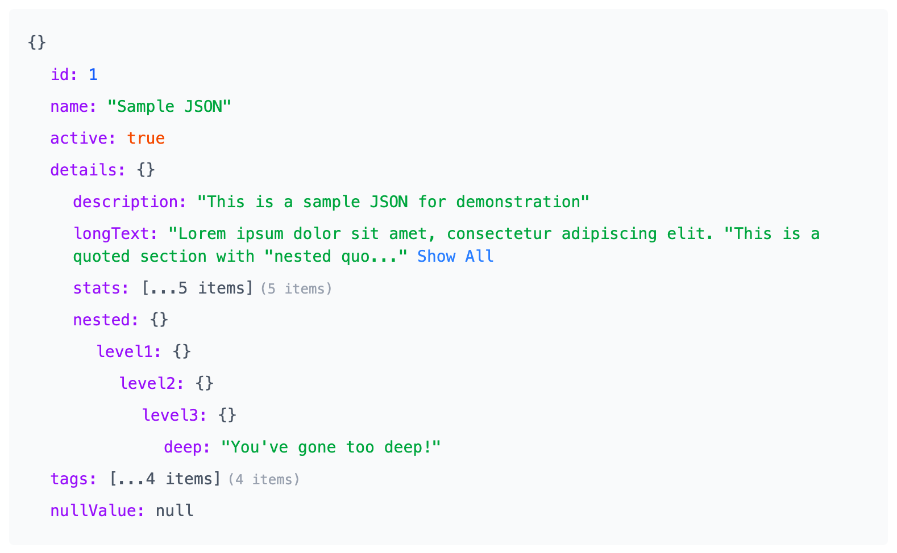

# Shiny JSON Preview

Shiny JSON Preview is a very basic React-based JSON viewer component that allows users to explore JSON data in a structured and interactive way. It supports nested objects, arrays, and long strings with features like expand/collapse and string previews.



## Features

- **Expandable Nodes**: Expand or collapse JSON objects and arrays for better navigation.
- **String Previews**: View long strings with a "Show All" option for full visibility.
- **Type Highlighting**: Different data types (e.g., strings, numbers, booleans) are color-coded for clarity.
- **Web Component**: The JSON viewer is also available as a web component for easy integration into non-React projects.

## Installation

1. Clone the repository:
   ```bash
   git clone https://github.com/your-username/shiny-json-preview.git
   cd shiny-json-preview
   ```

2. Install dependencies:
   ```bash
   npm install
   ```

3. Start the development server:
   ```bash
   npm start
   ```

## Usage

### React Component

You can use the `JSONViewer` component in your React application:

```tsx
import JSONViewer from "./src/JSONViewer";

const App = () => {
  const sampleData = {
    id: 1,
    name: "Sample JSON",
    active: true,
    details: {
      description: "This is a sample JSON for demonstration",
      stats: [1, 2, 3],
    },
  };

  return <JSONViewer data={sampleData} />;
};

export default App;
```

### Web Component

The JSON viewer is also available as a web component. You can use it in any HTML file:

```html
<script src="path-to-your-build/json-viewer.js"></script>

<json-viewer data='{"id":1,"name":"Sample JSON","active":true}'></json-viewer>
```

## Development

### File Structure

- `src/JSONViewer.tsx`: Main React component for rendering JSON data.
- `src/json-viewer.css`: Tailwind CSS styles for the component.
- `public/`: Static assets and the entry point for the web component.

### Scripts

- `npm start`: Start the development server.
- `npm run build`: Build the project for production.
- `npm test`: Run tests (if applicable).

## License

This project is licensed under the MIT License. See the [LICENSE](LICENSE) file for details.

## Contributing

Contributions are welcome! Please open an issue or submit a pull request for any improvements or bug fixes.
